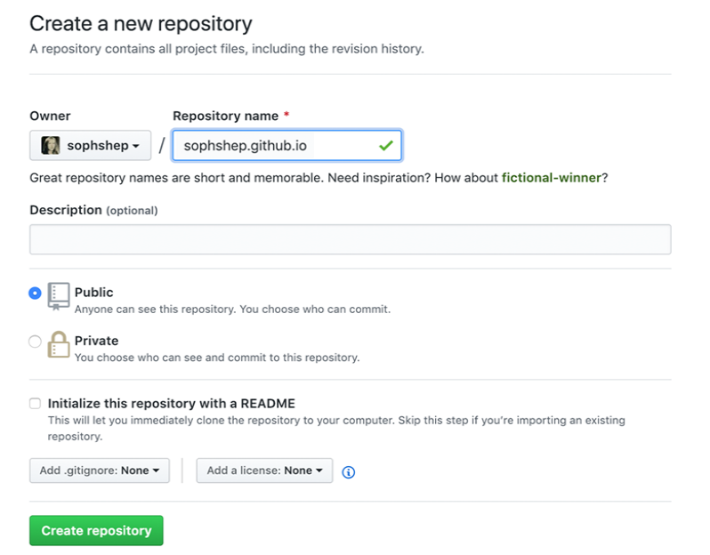

# Início

O GitHub Page consiste em um serviço de hospedagem de site estático, ou seja, um projeto que utiliza arquivos HTML, CSS e JavaScript diretamente de um repositório no GitHub. 
Essa hospedagem ocorre pela execução dos arquivos procedida pela publicação em um site.

A ferramenta permite hospedar o seu site no domínio github.io do GitHub ou no seu próprio domínio personalizado, caso você o informe. 
Ao menos que você esteja utilizando um domínio próprio, os sites criados pelo GitHub Pages serão disponibilizados em 
http(s)://<username>.github.io/<repository>, em que <username> corresponde ao nome de usuário da sua conta por lá, e <repository> corresponde ao nome do repositório do projeto a ser publicado.

Este manual foi desenvolvido baseado nas informações disponíveis no [GitHub Pages](https://pages.github.com/).

## Minha primeira GitHub Page

Para criar o seu primeiro site no GitHub Page é muito simples, pois basicamente você deve executar 5 passos:

1. Criar um repositório

2. Clonar o repositório

3. Adicionar ``index.html``

4. Confirmar suas mudanças

5. Pronto!

## Criar um repositório
Vá até o GitHub e crie um novo repositório público chamado username .github.io, 
onde username é seu nome de usuário (ou nome da organização) no GitHub.

  ?Obs.: Se a primeira parte do repositório não corresponder exatamente ao seu nome de usuário, 
  não funcionará, portanto, certifique-se de acertar.
  
  

## Clonar o repositório
Vá para a pasta onde você deseja armazenar seu projeto e clone o novo repositório:
  
  
  
## Adicionar ``index.html``
Entre na pasta do projeto e adicione um arquivo index.html:
  
 
 
## Confirmar suas mudanças
Adicione, confirme e envie suas alterações:
  
  

## Pronto!
 Abra um navegador e vá para https:// username .github.io .
